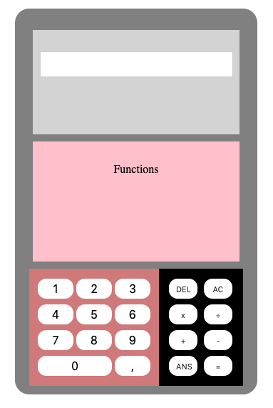
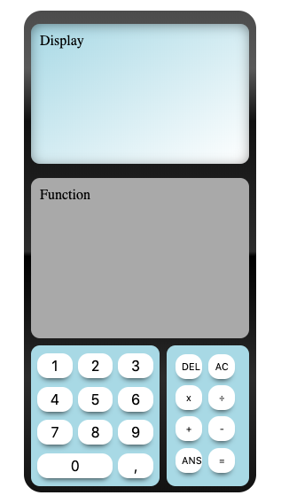

## FancyCalc

#### to-Do
- [x] arrange all html elements via grid
- [ ] display of numbers via
    - input or
    - normal element
- [ ] input can be entered via
    - [x] button-clicks
    - [ ] keyboard-input
- [ ] equals function
    - for-loop wont work
- [ ] noOpTwice function

#### Current State:

 

