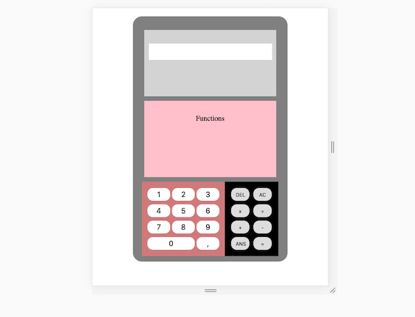

## FancyCalc

#### to-Do
- [] arrange all html elements via grid
- [] divide-sign can't be pushed into array
* [] display of numbers via
    * [] input or
    * [] normal element
* [] input can be entered via
    * [] button-clicks
    * [] keyboard-input

#### Current State:

